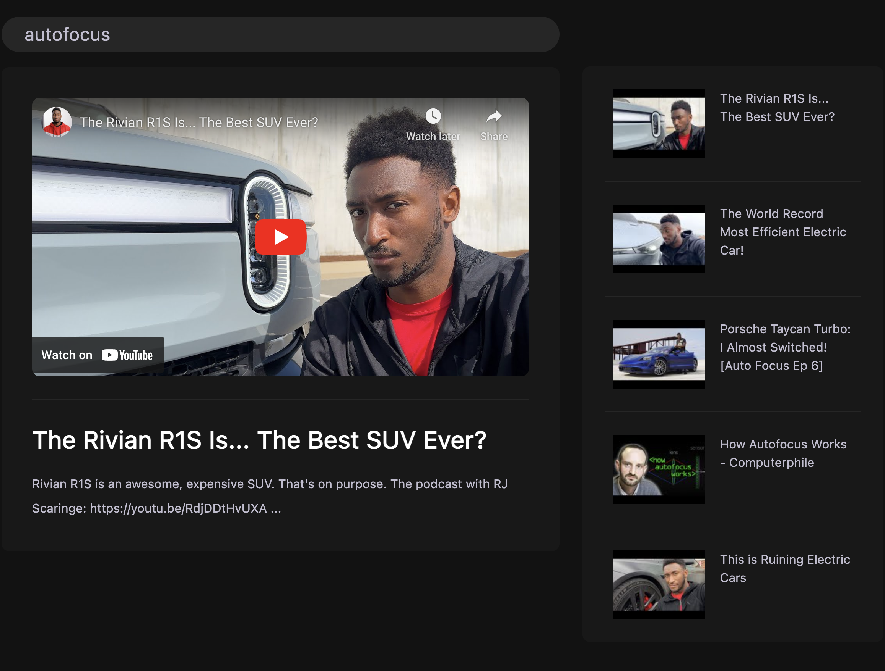

# CS52 SA3: Video Search

[deployed url](https://video-search-pkvn.onrender.com/)

## What Worked Well

- The Youtube API is surprisingly easy to work with, or maybe it's because
  you guys told us everything we needed to do.
- React is also quite interesting.

## What Didn't

GitHub wouldn't let me push my commits upstream, and when I force-pushed it closed the feedback PR. I couldn't figure out how to reopen it, see the comment on the PR.

## Extra Credit

I attempted to implement the `debounce` function, although my API timed out before I could fully test it.

> Update: I fixed it! It works now.  
> Implementation is in [`src/modules/debounce.js`](./src/modules/debounce.js)

## Screenshots

